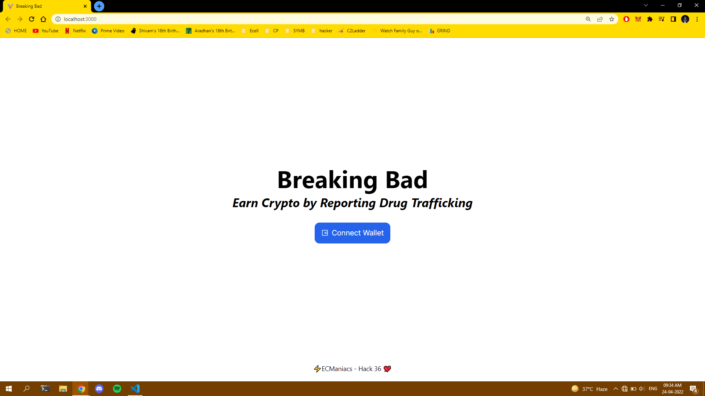
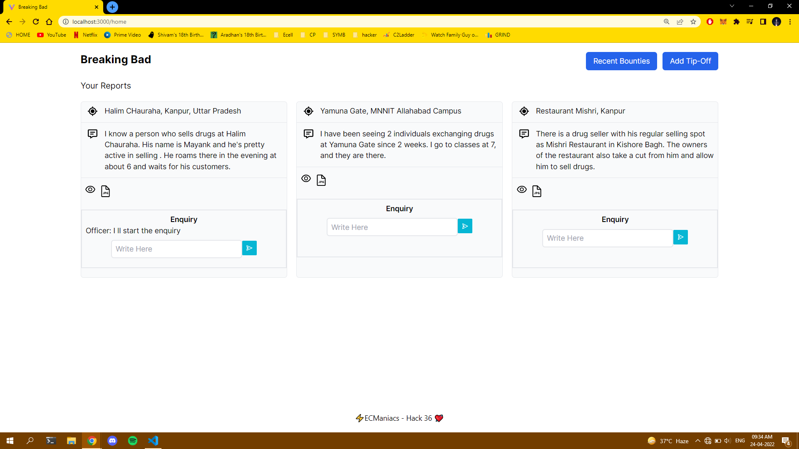
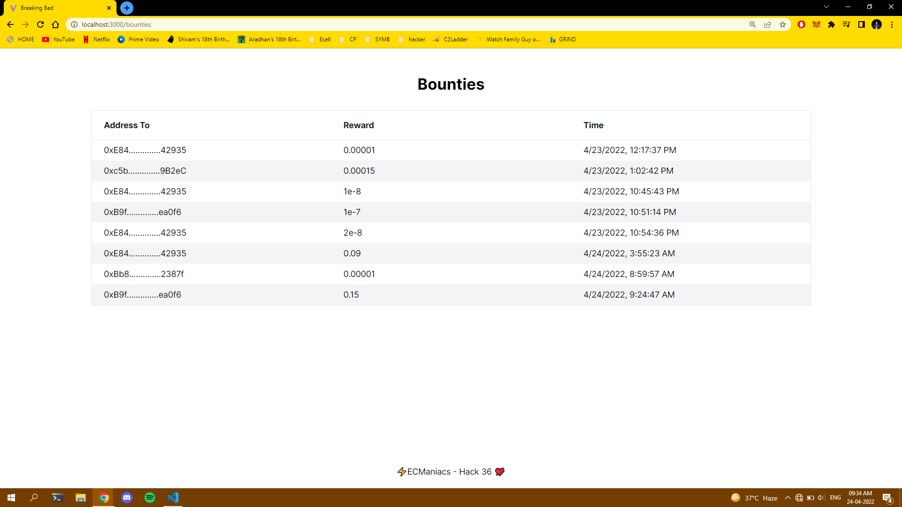
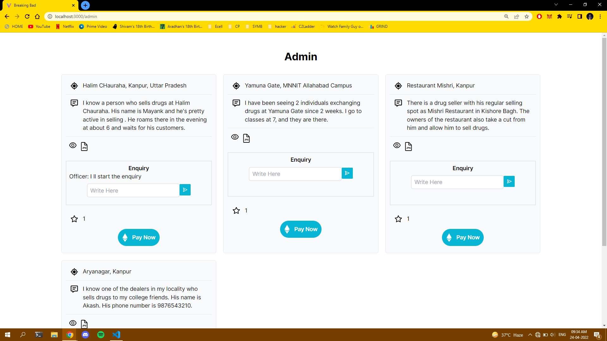

# BreakingBad

This project was developed by us, **Team Jupiter**

## Resources
- [PPT](https://docs.google.com/presentation/d/1vugyK7uB-tNwixAzP1h-AekcO23VNyw1i5kpQZqYEsg/edit?usp=sharing)
- [Video Demo](https://youtu.be/6RQyqa3RLoc)

## Team Jupiter
- Vanshika Srivastava
- Vedika Chauhan

---

Breaking Bad is a webapp that enables public to report the findings of drug trafficking in their locality completely anonymously(ensured by using Web3) and gives power to the Police authorities to reward the legit complaints with ethereum.

## Why We Built This
India lies sandwiched between two of the world’s “three key production areas” for opiates and cannabis, leading to an illicit drugs crisis. Drug addiction is a complex and widespread health issue for India and drug trafficking is the major reason behind it.

Currently there is no digital way of reporting drug trafficking. The only way is to reach out Narcotics squad or nearby police station. However, this is not feasible since majority of public will not be ready to disclose their profile due to fear or will not be ready to spend their time physically. Therefore, this crime continues to go on unchecked.

## Technologies Used and Working

- Smart Contracts: We wrote our smart contracts in Solidity. We used Hardhat to run them on a development network and test them and finally deployed them on the Blockchain. We use these contracts to make ETH transactions in our app.
- Frontend: We used ReactJS for UI and TailwindCSS for styling.
- Backend: We used ExpressJS to create the server and listen to requests from client. MongoDB Atlas as our database for storing information about the tip-offs.
- Metamask: MetaMask is a software cryptocurrency wallet used to interact with the Ethereum blockchain. We used its browser extension to access the Ethereum wallet and interact with our application.
- Tensorflow: We created a deep learning classifier model which classifies text as either gibberish or meaningful. We used a Amazon review dataset which was available on Kaggle. This helps to reduce spam.
- Flask: We created another server using flask through which we host our deep learning model. The client interacts with this server when we create a tipoff and checks if it is spam or not.

## Demo

## Challenges We Faced
1. Detection of Spam Tipoffs
2. Writing Smart Contracts
